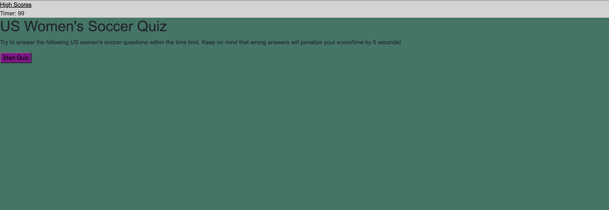

# Code-quiz

## Description

When the start button is clicked, a timer starts and the user is presented with the first question.

When the user answers a question, they are presented with another question.

If the user answers a question incorrectly, 5 seconds is subtracted from the clock.

When all the questions are answered or the timer finally reaches 0, the game is over.

When the gmae is over, the user can save their initials and view their score.

## Screenshot

